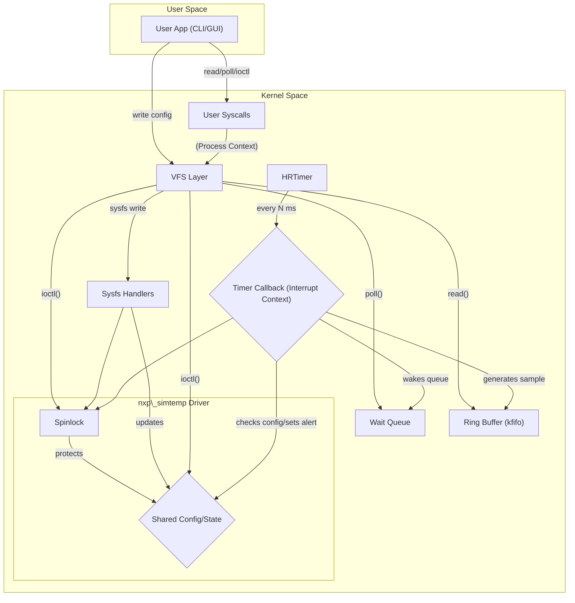

# **Virtual Sensor Driver Design and Architecture (nxp_simtemp)**

This document details the architecture, implementation choices, and performance analysis of the nxp_simtemp kernel module.

## **1\. Architecture Overview and Components 💡**

The system is built on the Linux **Platform Driver model**, splitting functionality between the Kernel Space data producer (timer) and the User Space data consumer (CLI/GUI).

### **1.1. Component Breakdown**

| Component            | Technology                          | Rationale                                                                                                                                                                                                       |
| :------------------- | :---------------------------------- | :-------------------------------------------------------------------------------------------------------------------------------------------------------------------------------------------------------------- |
| **Character Device** | **miscdevice** (/dev/simtemp)       | Simpler than a standard cdev setup; uses the reserved major number (10) for single, unclassified devices, simplifying device node creation.                                                                     |
| **Timing**           | **High-Resolution Timer (hrtimer)** | Provides accurate, configurable periodic sampling in milliseconds, critical for meeting timing requirements.                                                                                                    |
| **Data Buffer**      | **kfifo**                           | A lock-free, thread-safe FIFO buffer (with external locking) ideal for passing samples from the producer (timer) to the consumer (user read).                                                                   |
| **Synchronization**  | **Spinlock** (sdev-\>lock)          | Chosen to protect all shared data (config variables, kfifo, and event flags) between the **interrupt context** (hrtimer callback) and **process context** (syscalls). Mutexes are illegal in interrupt context. |
| **Blocking/Events**  | **Wait Queue** (sdev-\>wq)          | Used in read and poll to allow the user process to sleep until a new sample or a high-priority alert event is generated.                                                                                        |

### **1.2. Block Diagram and Concurrent Access Flow**

## **2\. Implementation and API Trade-offs**

### **2.1. Interaction Flow Summary**

| Phase              | Entry Point         | Action                                                                                                                                                                        |
| :----------------- | :------------------ | :---------------------------------------------------------------------------------------------------------------------------------------------------------------------------- |
| **Initialization** | simtemp_module_init | Triggers the .probe function (via DT on target, or manually via platform_device_alloc() in PC Build mode). Allocates resources, registers miscdevice, and starts the hrtimer. |
| **Data Prod.**     | hrtimer Callback    | Generates sample, pushes to kfifo, checks threshold against **Shared State **, and calls wake_up_interruptible() on the **Wait Queue**.                                       |
| **Data Cons.**     | read()              | Blocks on **E** until data is available, then pulls one sample from the kfifo and copies it to user-space.                                                                    |
| **Re-config.**     | sysfs store / ioctl | Updates configuration variables (D). **All updates to D and timer manipulation must be protected by the Spinlock**.                                                           |

### **2.2. API Choice Justification**

| Interface               | Purpose                  | Pros & Cons                                                                                                                                                                                             |
| :---------------------- | :----------------------- | :------------------------------------------------------------------------------------------------------------------------------------------------------------------------------------------------------ |
| **Read (/dev/simtemp)** | **Data Transfer**        | **Pros**: Binary data provides the fastest, most compact transfer without string parsing overhead.                                                                                                      |
| **Poll**                | **Event Alerting**       | **Pros**: Allows user app to wait for data (EPOLLIN) and high-priority alerts (EPOLLPRI) simultaneously.                                                                                                |
| **IOCTL**               | **Atomic Configuration** | **Pros**: Allows for atomic updates of multiple parameters (e.g., mode and threshold) in a single syscall via a struct, preventing race conditions. **Cons**: Requires custom user-space C/Python code. |
| **Sysfs**               | **Simple Configuration** | **Pros**: Modern, user-friendly, and scriptable interface (via echo/cat). **Cons**: Not atomic; sequential writes can cause a transient race condition (e.g., new mode applied before new threshold).   |

### **2.3. Locking and Concurrency**

A **Spinlock** is mandatory due to concurrency between the **Process Context** (syscalls) and the **Interrupt Context** (hrtimer callback).

- **Critical Bug Discovered:** An early design would update config variables inside the lock but perform timer manipulations (hrtimer_start) outside the lock. This led to a race condition and subsequent kernel crash.
- **Solution:** All functions that modify the timer state or access the configuration variables **must be protected by spin_lock_irqsave / spin_unlock_irqrestore** to serialize access against the high-priority timer interrupt.

## **3\. Scaling and Performance Analysis**

### **3.1. DT Mapping (Embedded Target)**

The driver is registered using module_platform_driver(simtemp_driver).

1. **Binding:** The driver uses an of_match_table that lists compatible \= "nxp,simtemp".
2. **Trigger:** At boot, the kernel parses the Device Tree Overlay (.dtbo) that contains a node with this compatible string, triggering the driver's .probe function.
3. **Config:** Inside probe, functions like of_property_read_u32(..., "sampling-ms", ...) read the initial configuration directly from the Device Tree, providing initialization persistence and resilience.

### **3.2. Scaling: What breaks first at 10 kHz sampling?**

Sampling at 10 kHz (a sample every 100µs) would severely stress this design and lead to data loss:

1. **Interrupt Overhead/HR-Timer Frequency:** The CPU would struggle to execute the timer callback 10,000 times per second. The overhead of entering and exiting the interrupt context would consume a large percentage of CPU time, causing the timer to run late.
2. **Lock Contention:** The spinlock would be acquired and released 10,000 times per second by the timer alone. Any syscall attempting to access shared state would spend significant time spinning, wasting cycles.
3. **kfifo Overflow (Data Loss):** The user-space app must be scheduled and call read() 10,000 times per second. Any slight delay in the scheduler would cause the kfifo to quickly fill and silently drop data, as the driver is designed to discard samples on buffer overrun.

### **3.3. Mitigation Strategies**

1. **Batching/Aggregation:** This is the most practical kernel-level fix. The timer should run less frequently (e.g., 10 times/second) and aggregate multiple raw samples into a single summary record (min/max/average temperature) before writing one summarized record to the kfifo. This drastically reduces I/O overhead.
2. **mmap / Shared Memory:** For true zero-latency, high-speed applications, the driver should implement mmap() to create a shared memory ring buffer between kernel and user space, eliminating the overhead of copying data via the read() syscall.
